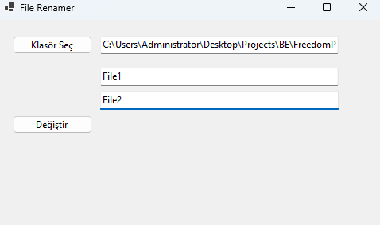

# File Renamer 📁

[English](#english) | [Türkçe](#türkçe)

## English

### Description
File Renamer is a simple yet powerful Windows application that helps you rename multiple files, folders, and their contents simultaneously. It's perfect for bulk renaming operations in your projects.

### Features
- Rename files and folders recursively
- Replace text within file contents
- Case-insensitive search and replace
- Change file extensions
- Automatic preview in Notepad after changes
- User-friendly interface

### Download
> ⚠️ The application will be available for download soon. Please check back later!

After deployment, you'll be able to download from:
👉 [Download Latest Version (FileRenamer.exe)](https://github.com/akkayaberkin/FileRenamer/releases/latest/download/FileRenamer.exe)

### How to Use
1. Click "Klasör Seç" to select the target folder
2. Enter the text you want to replace in "Eski İsmi Girin"
3. Enter the new text in "Yeni İsmi Girin"
4. Click "Değiştir" to start the renaming process
5. Review the changes in automatically opened Notepad windows

### System Requirements
- Windows Operating System
- .NET Framework 4.7.2 or higher

---

## Türkçe

### Açıklama
File Renamer, birden fazla dosya, klasör ve içeriklerini aynı anda yeniden adlandırmanıza yardımcı olan basit ama güçlü bir Windows uygulamasıdır. Projelerinizdeki toplu yeniden adlandırma işlemleri için mükemmeldir.

### Özellikler
- Dosya ve klasörleri alt klasörler dahil yeniden adlandırma
- Dosya içeriklerindeki metinleri değiştirme
- Büyük/küçük harf duyarsız arama ve değiştirme
- Dosya uzantılarını değiştirme
- Değişikliklerden sonra Notepad'de otomatik önizleme
- Kullanıcı dostu arayüz

### İndir
> ⚠️ Uygulama yakında indirilebilir olacaktır. Lütfen daha sonra tekrar kontrol edin!

Deployment sonrası buradan indirebilirsiniz:
👉 [Son Sürümü İndir (FileRenamer.exe)](https://github.com/akkayaberkin/FileRenamer/releases/latest/download/FileRenamer.exe)

### Nasıl Kullanılır
1. Hedef klasörü seçmek için "Klasör Seç" butonuna tıklayın
2. "Eski İsmi Girin" alanına değiştirmek istediğiniz metni girin
3. "Yeni İsmi Girin" alanına yeni metni girin
4. Yeniden adlandırma işlemini başlatmak için "Değiştir" butonuna tıklayın
5. Değişiklikleri otomatik açılan Notepad pencerelerinde inceleyin

### Sistem Gereksinimleri
- Windows İşletim Sistemi
- .NET Framework 4.7.2 veya üzeri

---

## Screenshots / Ekran Görüntüleri

## License / Lisans
MIT License / MIT Lisansı 